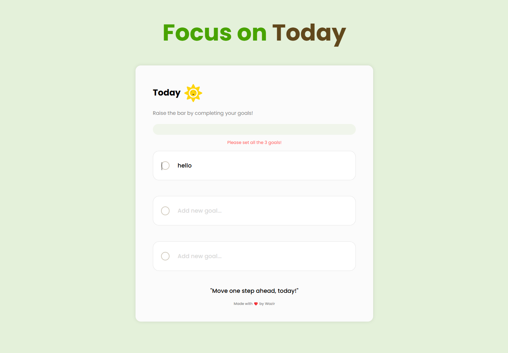
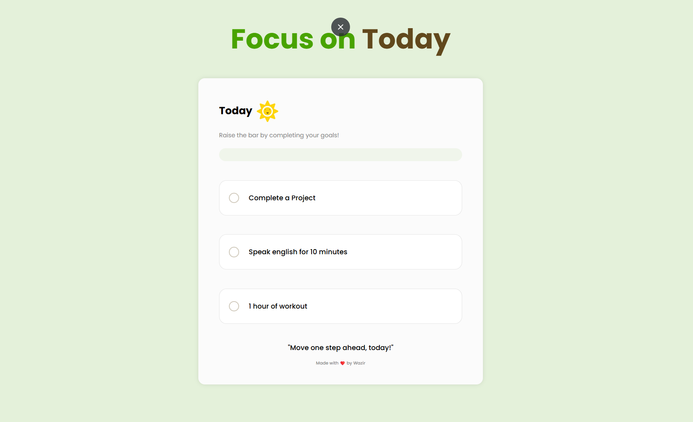
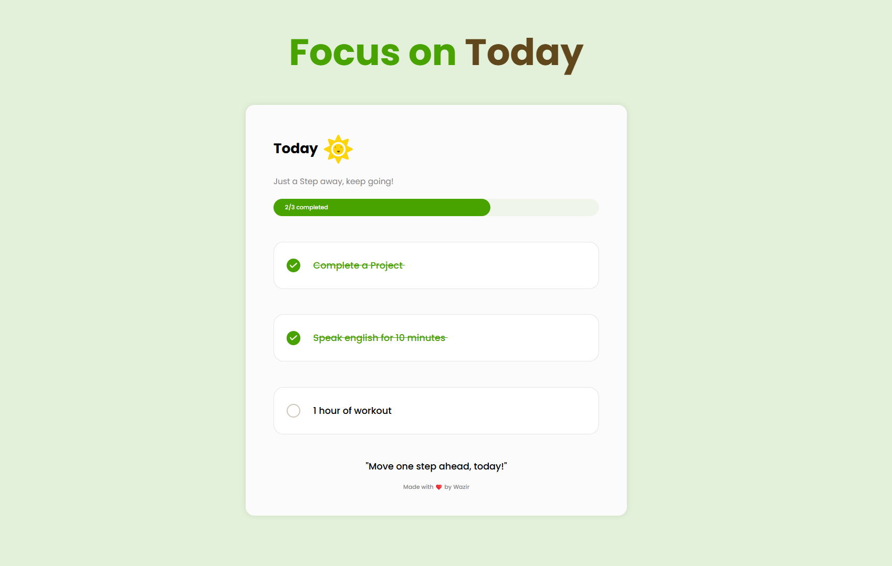
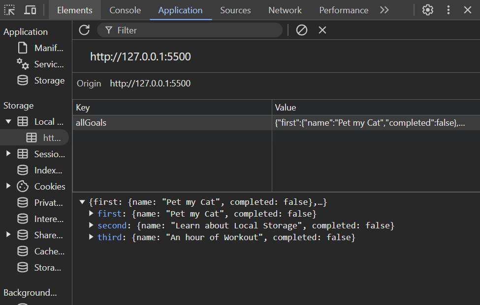

# Focus on Today

`Focus on Today` is a simple, kind of to-do app.

### Features:
- **Allow you to add up to 3 tasks**: Add up to three daily goals and mark them as completed with just a click.
- **Dynamic Progress Bar**: Get visual feedback on your progress and be motivated by changing quotes.
- **Customizable Goals**: The app remembers your goals, even if you close and reopen it, thanks to local storage.
- **Usage of local storage**: i have utilized the use of local storage and added data there, which prevents data loss when you reload the page.
- **Error Handling**: Prompts you if any of your goals are left undefined.

### What I learned creating this project:
- **JavaScript DOM Manipulation**
- **Local Storage**
- **Event listeners**
- **Error Handling**

This project uses HTML, CSS, and JavaScript to ensure a seamless experience across all devices.

- ### Here is  [Focus on Today](https://focusontodaybyme.netlify.app/) link.

## Preview

    

    

    

Local storage utilized:

    

## Reference
I took the reference of this project from:
- [YouTube](https://www.youtube.com/watch?v=fEl3ENm__rg&list=PLfEr2kn3s-br9ZFmejfLhAgMbGgbpdof8&index=115)
