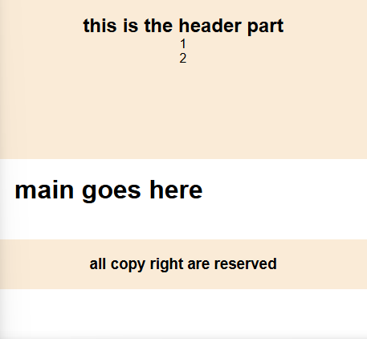
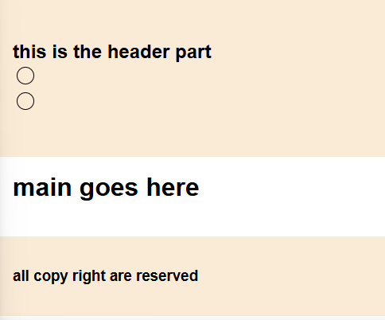
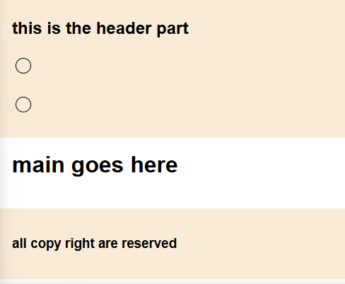
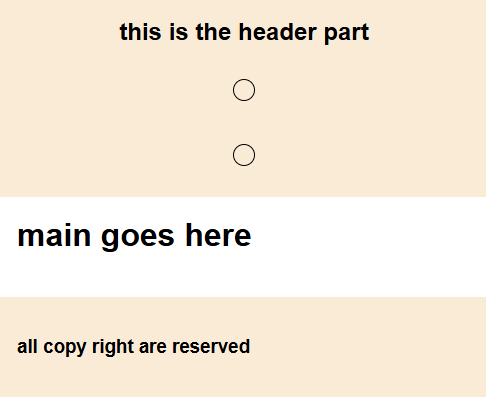
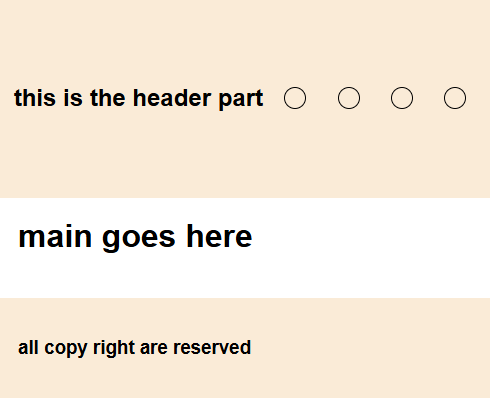
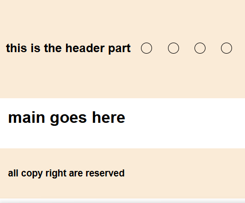

# Aligning `items` horizontally, vertically and centered in header and footer

## Align Header and Footer Content Centered Horizontally

- `text-align: center;` to Center item horizontally
- this doesn't require `display: flex;`

**CSS:**

```CSS
header, footer {
    text-align: center;
    padding: 20px;
}
```

<p align="center">
    
</p>

## Align Header and Footer Content Centered Vertically

### Using `Flexbox`

- use `display: flex;` to enable flexbox
- `flex-direction: column;` to flex item in vertically
- `justify-content: center;` to align item centered vertically

**CSS:**

```CSS
header, footer {
  display: flex;
  flex-direction: column;
  justify-content: center;
  padding: 20px;
}
```

<p align="center">
    
</p>

### Using `Grid`

- `display: grid;` to enable grid
- `align-items: center;` to center items in respective grid
- by-default, the items aligned to the left

```CSS
header, footer  {
  height: 200px;
  background-color: antiquewhite;
  display: grid;
  align-items: center;
  padding: 20px;
}
```

<p align="center">
    
</p>

## Align Header and Footer Content Centered Horizontally and Vertically

### Using `Flexbox`

- `display: flex;` to enable flexbox
- `justify-content: center;` center horizontally
- `align-items: center;` center vertically

**CSS:**

```CSS
header, footer {
  display: flex;
  justify-content: center;
  align-items: center;
  padding: 20px;
}
```

<p align="center">
    
</p>

### Using `Grid`
- prefer using `flexbox` to center item horizontally and vertically
- and use `grid` when you need to center item horizontally and vertically in `column`

but, if you want to use grid:
- `grid-auto-flow: column;` Arrange items in a single row
- `align-items: center;` Centers vertically

## Align Header and Footer Content Centered Horizontally and Vertically in column

### Using `Flexbox`

- `display: flex;` to enable flexbox
- `justify-content: center;` center horizontally
- `align-items: center;` center vertically

**CSS:**

```CSS
header, footer {
  display: flex;
  flex-direction: column;
  justify-content: center;
  align-items: center;
  padding: 20px;
}
```

<p align="center">
    
</p>

### Using `Grid`
- `display: grid;` to enable grid
- `place-items: center;` to place all item in center
- by-default, they are placed in first row of each column (essentially, they fill the grid row by row)

**CSS:**
```CSS
header, footer {
  display: grid;
  place-items: center;
  padding: 20px;
}
```

<p align="center">
    
</p>


## Center items in the header/footer both horizontally and vertically with even spaces between them

### Using `Flexbox`

- `display: flex;` to enable flexbox
- `justify-content: space-around;`/`justify-content: space-between;` center items evenly spaced horizontally
- `align-items: center;` center vertically

**CSS:**

```CSS
header, footer {
  display: flex;
  flex-direction: column;
  justify-content: space-around;
  /* justify-content: space-between; */
  align-items: center;
  padding: 20px;
}
```

<p align="center">
    
</p>

### Using `Grid`
- `display: grid;` to enable grid
- `grid-auto-flow: column;` Arrange items in a single row
- `justify-content: space-around;`  Even spacing between items horizontally
- `place-items: center;` to place all item in center vertically
- by-default, they are placed in first row of each column (essentially, they fill the grid row by row)

**CSS:**
```CSS
header, footer {
  display: grid;
  grid-auto-flow: column;
  align-items: center;
  justify-content: space-around;
  padding: 20px;
}
```

<p align="center">
    
</p>

### **Key CSS Properties for Alignment**

1. **`text-align: center;`**  
   Horizontally aligns text inside a block element.

2. **`display: flex;`**  
   Enables Flexbox layout for centering both horizontally and vertically:

   - `justify-content: center;` centers horizontally.
   - `align-items: center;` centers vertically.

3. **`position: fixed;` or `position: sticky;`**  
   Use these to make the header and footer stick to the top or bottom.

4. **`min-height: 100vh;` with `flex: 1;`**  
   Ensures the footer stays at the bottom even when the main content is short.
