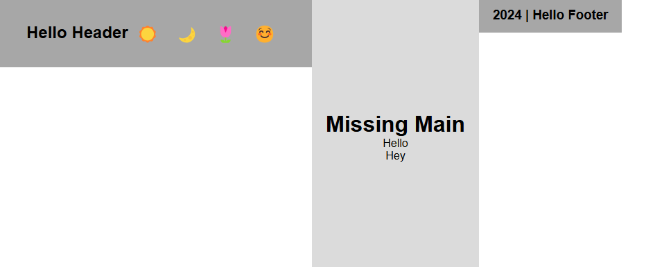
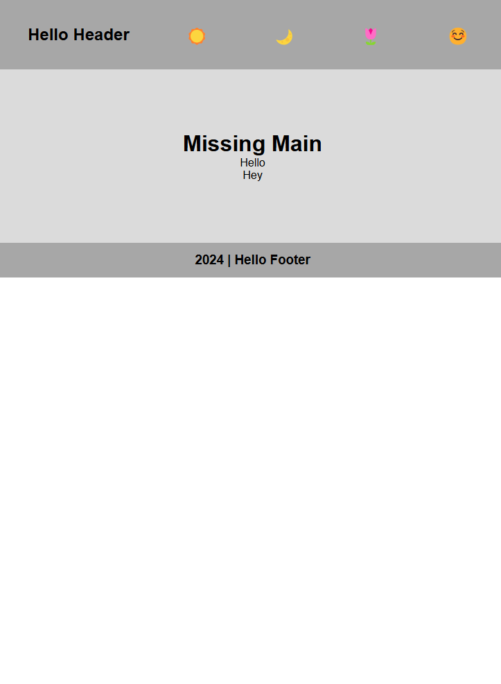
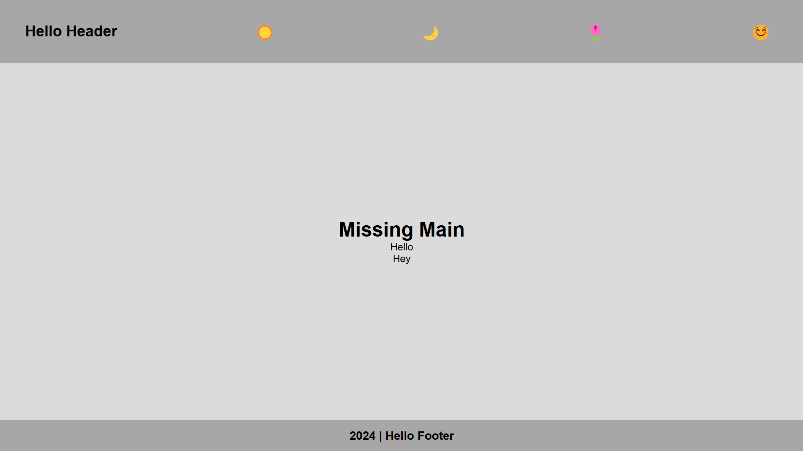
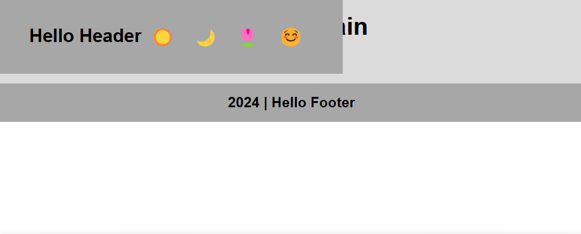
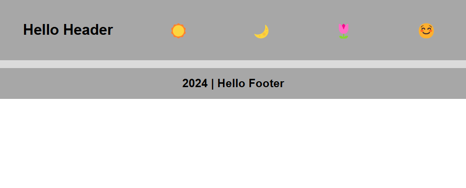
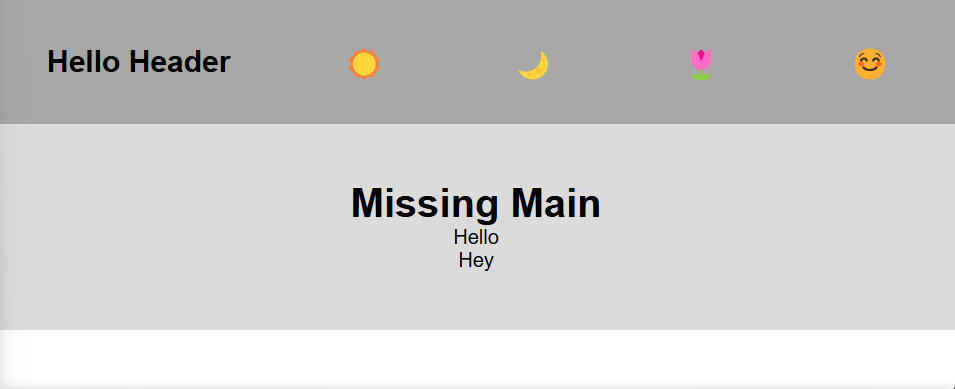
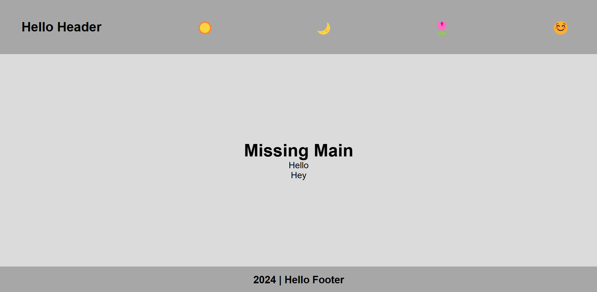

# Aligning `header/main/footer` with respect to `Viewport`

## Align Header, Main and Footer Centered Vertically 

### Using `Flexbox`

**Apply these on the body**
- `display: flex;` to enable flexbox (which automatically flex header, main, and footer horizontally)
<p>
    
</p>

- `flex-direction: column;` flex header, main, and footer vertically (will occupy the height of the body)
<p>
    
</p>

- `justify-content: space-between;`/`justify-content: center;` to align them
- `height: 100vh;` Make the body fill the viewport height
- i've applied `flex:grow: 1` to make sure it takes up the remaining space (or we can use `height: 100%` to `main`, so that it can occupy all remaining height)

**CSS:**

```CSS
body {
  display: flex;
  flex-direction: column;
  justify-content: space-between; 
  height: 100vh;
}
```

<p align="center">
    
</p>


### Using `Flexbox` (Footer Sticky at Bottom)
If you want the footer to always stay at the bottom of the page, but the content in the main section should grow and shrink:

```CSS
body {
  display: flex;
  flex-direction: column;
  height: 100vh; /* Full height */
  margin: 0;
}

header {
  background-color: lightcoral;
  padding: 10px;
}

main {
  flex-grow: 1; /* Take remaining space */
  background-color: lightblue;
  padding: 20px;
}

footer {
  background-color: lightgreen;
  padding: 10px;
}
```

### Explanation:
- **`flex-grow: 1;`** on `main` makes it grow and fill the remaining space, pushing the footer down to the bottom.
- The footer will always be at the bottom of the screen, even if the content in the main section is smaller.

### Using `CSS Grid`

- `display: grid;` makes body a grid container
- `grid-template-rows: auto 1fr auto;` defines three rows: `auto` for the header and footer (they will take as much height as needed), and `1fr` for the main content, which will take the remaining space.
- `height: 100vh;` for occupying full viewport height

**CSS:**

```CSS
body {
  display: grid;
  grid-template-rows: auto 1fr auto;
  height: 100vh; 
}
```

<p align="center">
    
</p>

## Using `Absolute Positioning`

You can also use absolute positioning to place the `<header>`, `<main>`, and `<footer>` sections at specific positions within the viewport.

- `position: relative;` make the body a relative positioned container
- `height: 100vh;` full viewport height
- `position: absolute;` position the header at the top
<p>
    
</p>

- give `top: 0px;`, `left: 0px;`, and `right: 0px;` to the `header` to make it stick at the top with a distance of 0, 0, 0px from top, left, and right
<p>
    
</p>

- **give similar property to `main` and `footer` too:**
- `main`: `position: absolute;`, `top: 100px;`, `left: 0;`, `right: 0;`, `bottom: 50px;`,  and you can give desired height (`height:100%`) to main
<p>
    
</p>

- `footer`: `position: absolute;`, `left: 0;`, `right: 0;`, `bottom: 0px;`,  and you can give desired height (`height:100%`) to main

```CSS
body {
  font-family: Arial, sans-serif;
    position: relative;
  height: 100vh;
}
header {
  position: absolute;
  top: 0px;
  left: 0px;
  right: 0px;
  height: 100px;
  padding:40px;
  display: flex;
  justify-content: space-between;
  align-items: center;
}
main {
  position: absolute;
  top: 100px;
  left: 0;
  right: 0;
  bottom: 50px;
}
footer {
  position: absolute;
  bottom: 0;
  left: 0;
  right: 0;
  height: 50px;
}
```
<p align="center">
    
</p>

### Explanation:
- **Absolute positioning**: The `header`, `main`, and `footer` are all absolutely positioned relative to the `body` (which is set to `position: relative`).
- `top`, `bottom`, `left`, and `right` are used to specify the exact position of each element. The `main` element is pushed down with `top: 60px;` to prevent overlap with the `header`, and `bottom: 50px;` ensures it doesn't cover the `footer`.


### Summary:
You can align the `<header>`, `<main>`, and `<footer>` using various techniques depending on the desired layout:
- **Flexbox**: Great for flexible layouts, either stacked vertically or horizontally.
- **CSS Grid**: Perfect for precise control over rows and columns.
- **Absolute Positioning**: Used for fixed positioning elements on the screen, but requires careful management of heights.
